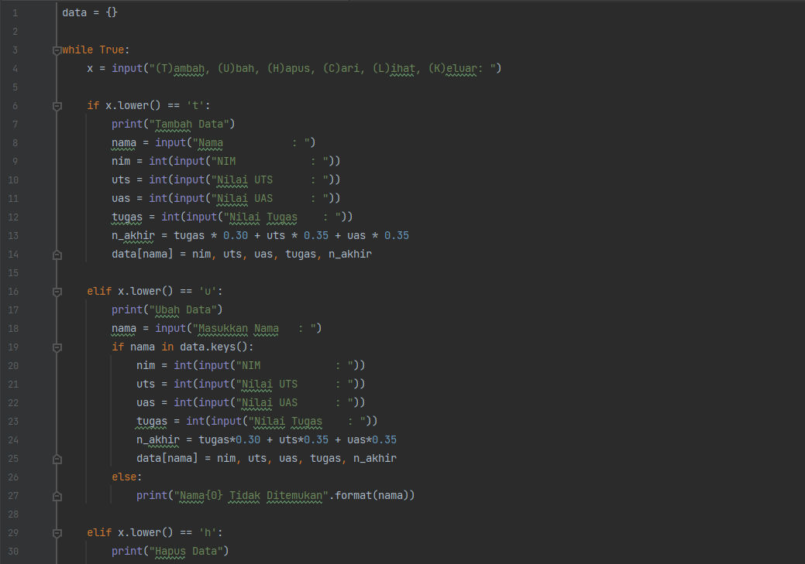
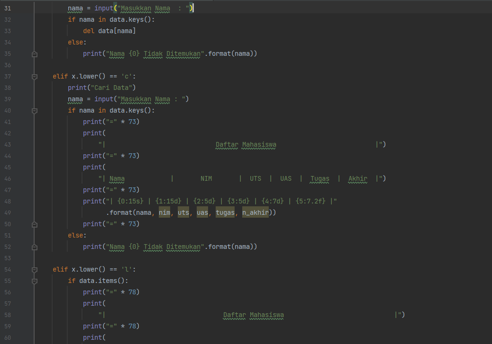
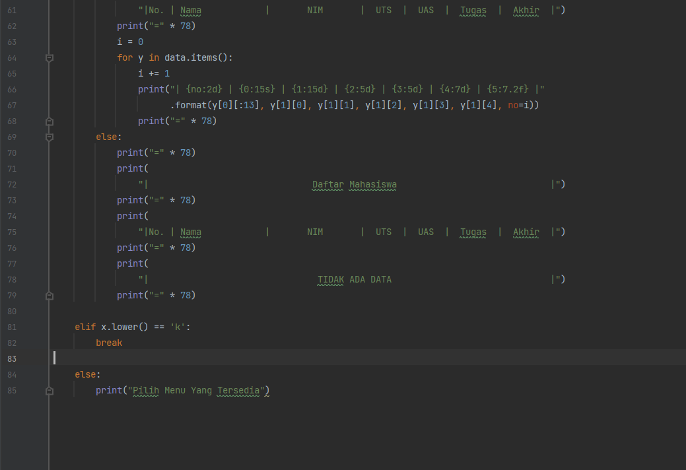

# PRAKTIKUM 5


## Program
dibawah ini adalah program sederhana untuk membuat daftar nilai mahasiswa dengan mnggunakan **Dictionary**, dan menampilkan pilihan **Menu** Tambah, Ubah, Hapus, Cari, dan Lihat.






## Flowchart
Dan berikut adalah tampilan dari flowchartnya :


## Penjelasan

- Mendeklarasikan Dictonary kosong dengan synatax
`data = {}`
- Lalu membuat perulangan while dan untuk menginisialkan penambahan menu pilihan Tambah, Ubah, Hapus, Cari, Lihat, dan Keluar :
```py
while True:
    x = input("(T)ambah, (U)bah, (H)apus, (C)ari, (L)ihat, (K)eluar: ")
```

## Menambahkan Data
- Berikut adalah Syntax untuk menambahkan data dengan ketentuan jika kita mengetikkan `T` pada keyboard, maka akan melakukan penambahan data dan ditampung kedalam Dictonary `data` yang telah kita buat, dengan nama sebagai `keys` dan yang lainnya sbagai values.
```py   
    if x.lower() == 't':
        print("Tambah Data")
        nama = input("Nama           : ")
        nim = int(input("NIM            : "))
        uts = int(input("Nilai UTS      : "))
        uas = int(input("Nilai UAS      : "))
        tugas = int(input("Nilai Tugas    : "))
        n_akhir = tugas * 0.30 + uts * 0.35 + uas * 0.35
        data[nama] = nim, uts, uas, tugas, n_akhir
```
## Mengubah Data
- Printah dijalankan jika input yang dimasukkan adalah `U`, di dalam kondisi ini terdapat input dan kondisi, dimana jika input `nama` ada didalam variabel `data` maka akan muncul beberapa pilihan untuk mengubah semua data atau data tertentu saja.
```py    
    elif x.lower() == 'u':
        print("Ubah Data")
        nama = input("Masukkan Nama   : ")
        if nama in data.keys():
            nim = int(input("NIM            : "))
            uts = int(input("Nilai UTS      : "))
            uas = int(input("Nilai UAS      : "))
            tugas = int(input("Nilai Tugas    : "))
            n_akhir = tugas*0.30 + uts*0.35 + uas*0.35
            data[nama] = nim, uts, uas, tugas, n_akhir
        else:
            print("Nama{0} Tidak Ditemukan".format(nama))
```

## Menghapus Data 
- Sama seperti mengubah data yang dipilih.
- Data yang dihapus adalah data yang di input dalam variabel `nama` dimana berisi (string) yang mewakili **NIM, Nilai Tugas, UTS, UAS.** 