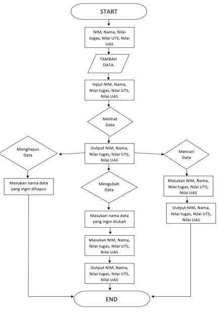

# PRAKTIKUM 5


## Program
dibawah ini adalah program sedeerhana untuk membuat daftar nilai mahasiswa dengan mnggunakan **Dictionary**, dan menampilkan pilihan **Menu** Tambah, Ubah, Hapus, Cari, dan Lihat.


## Flowchart
Dan berikut adalah tampilan dari flowchartnya :




## Penjelasan

- Mendeklarasikan Dictonary kosong dengan synatax
`data = {}`
- Lalu membuat perulangan while dan untuk menginisialkan penambahan menu pilihan Tambah, Ubah, Hapus, Cari, Lihat, dan Keluar :
```while True:```
    ``x = input("(T)ambah, (U)bah, (H)apus, (C)ari, (L)ihat, (K)eluar: ")``